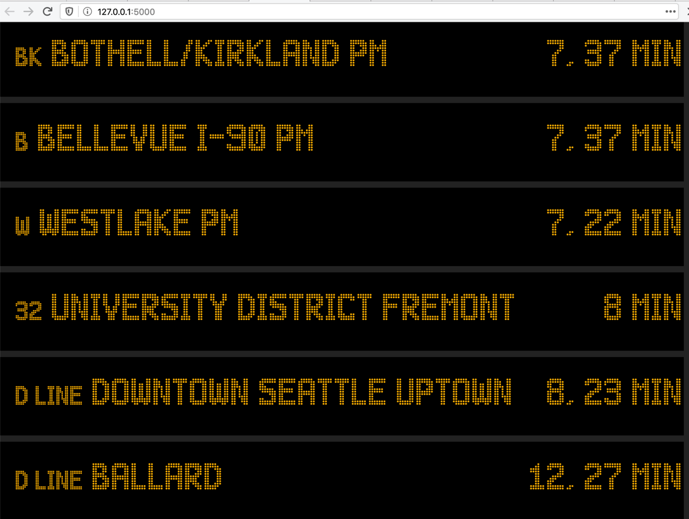

# shuttle.fyi

This app scrapes OneBusAway as well as Expedia's shuttle provider API to aggregate arrival times for both buses and Expedia shuttles. 

## Running locally

This project assumes you have Python (>=2.7) and `pip` installed. To run this
project, simply check it out and run `python arrivals_sign.py`.

Once it is running you can view it at [localhost:5000](http://localhost:5000).  

## In Use

This project aims to emulate the aesthetic of a subway station arrival sign. An example of what it may look like during rush hour: 

  
